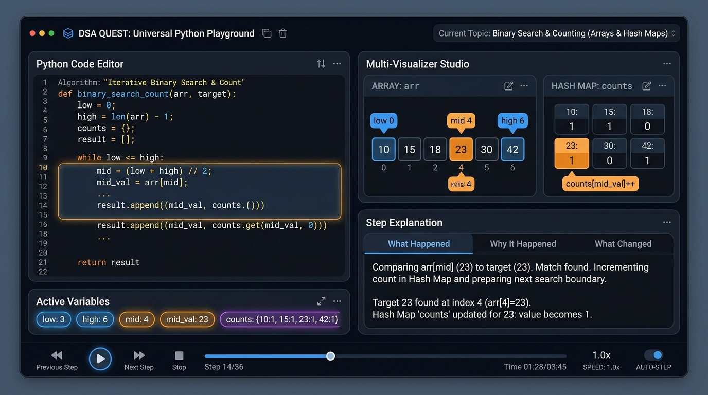

# DSA QUEST 🎮🐍

> *"Don't memorize DSA. Experience it."*

[](https://nextjs.org/)
[](https://www.typescriptlang.org/)
[](https://tailwindcss.com/)
[](https://www.python.org/)
[](https://fastapi.tiangolo.com/)
[](https://github.com/tejaswini143-byte/dsa-quest/actions)
[](https://opensource.org/licenses/MIT)

**DSA QUEST** transforms Data Structures & Algorithms from passive textbook reading into an interactive, game-like adventure and **Universal Python Execution Engine**.

Paste or write **any normal DSA Python code** into the editor and press **▶ RUN**. The universal engine safely executes, traces control flow, detects memory structures, and visualizes variable mutations line by line in real time.

---

## ✨ Features

- 🐍 **Universal Python Playground (`/playground`)**: Write or paste ANY DSA Python code or LeetCode `Solution` class with instant execution tracing and visual step-by-step playback.
- 🎬 **Multi-Structure Visualizer Studio**: Simultaneously renders multiple data structures (e.g., Graph + Queue for BFS, Graph + Heap for Dijkstra, Hash Map + Array for Two Sum, 2D Grid for Islands, Linked List for Pointers).
- ⚡ **Generic Fallback Mode**: If code doesn't match a specialized structure, it falls back to a clean generic execution tracer with active line glow, variable diffs, call stack, and stdout without crashing.
- 🎮 **Interactive DSA Games**: Reusable mechanics (*Pair Selection, Push/Pop Stack, Grid Island Flood-Fill, DP Staircase Ascent, Binary Search Walk*).
- 📖 **Real-Life Stories**: Every problem begins with a vivid real-world mission (*Ice Cream Budgeting, Mountain Weather Barometer, Archipelago Cartography, Magical Staircase*).
- 🧸 **Explain Like I'm 5 Mode**: 4 switchable cognitive perspectives (*ELI5*, *Beginner Friendly*, *Algorithmic Core*, and *FAANG Interview*).
- 💡 **Progressive Clues**: 5-tier hint engine (*Observation $\to$ Memory $\to$ Data Structure $\to$ Pattern $\to$ Complete Blueprint*).
- 📦 **Variable & Memory Diffs**: Live animated variable chips tracking state transitions ($seen: \{\} \to seen: \{2: 0\}$).
- 🤖 **AI Tutor Layer**: Interactive coaching assistant powered by Google Gemini API with comprehensive offline fallback.
- ✍️ **Code Practice Lab**: 5 interactive modes (*Fill in Blanks, Fix Bug, Predict Output, Reorder Lines, and Monaco Write-From-Scratch*).
- 📊 **Big-O Complexity Lab**: Dynamic operation counters scaling from $N=10$ to $N=5,000$ comparing Brute Force $O(n^2)$ vs Optimal $O(n)$.
- 🏆 **XP and Achievements**: Earn experience points, maintain daily streaks, unlock trophy badges, and level up.
- 🗺️ **DSA World Map**: Journey across thematic algorithm realms (*Array Forest, Hashing City, Stack Tower, Graph Galaxy, DP Temple*).
- ⚔️ **Pattern Recognition Arena**: Test interview intuition by classifying unseen problem statements into optimal patterns.
- 🧩 **Custom Problem Creator**: Add ANY new DSA problem via JSON configuration without writing a single line of frontend code.

---

## 🧠 Universal Engine Architecture

DSA Quest is **NOT** a collection of hard-coded algorithm pages. The application is powered by a **Universal Engine** where problems are defined purely as structured data.

```
                              LEARNER CODE OR REQUEST
                                         │
                                         ▼
                           [ Universal Python Sandbox ]
                              (AST Security & Tracer)
                                         │
                                         ▼
                             Execution Trace & Events
                       (Line, Vars, Memory, Semantic Events)
                                         │
                                         ▼
                           DSA Structure Detector
                      (Array, Stack, Grid, Graph, Heap, etc.)
                                         │
                                         ▼
                      ┌────────────────────────────────────┐
                      │    UNIVERSAL MULTI-VISUALIZER      │
                      └─────────────────┬──────────────────┘
                                        │
        ┌──────────────┬────────────────┼──────────────┬──────────────┐
        │              │                │              │              │
        ▼              ▼                ▼              ▼              ▼
  [Array & Map]   [Stack/Queue]   [Graph & Heap]   [2D Grid]      [DP Table]
   - Indices       - LIFO Chamber  - Nodes/Edges    - Matrix DFS   - Tabulation
   - Pointers      - FIFO Queue    - Min/Max Heap   - Sinking      - Dependency
   - Keys/Vals     - Deque         - Distances      - Coordinates  - Recursion
```

---

## 🎮 How Learning Works

```
REAL-LIFE STORY
      ↓
MISSION CHALLENGE
      ↓
INTERACTIVE GAME
      ↓
THINKING CHALLENGE
      ↓
CLUES & HINTS
      ↓
ALGORITHM INTEL
      ↓
STEP-BY-STEP VISUALIZATION
      ↓
LINE-BY-LINE PYTHON EXECUTION
      ↓
VARIABLE & MEMORY DIFFS
      ↓
PRACTICE (Fill Blanks • Fix Bug • Reorder)
      ↓
WRITE FROM SCRATCH (Monaco Editor)
      ↓
BIG-O COMPLEXITY SCALING
      ↓
PATTERN RECOGNITION CHALLENGE
```

---

## 🔥 Supported Demonstrations & Built-in Problems

All problems run through the **exact same universal engine and dynamic route** (`/problem/[id]`):

| Problem | Pattern | Primary Visualizer | Interactive Game Mechanic | Real-Life Story |
| :--- | :--- | :--- | :--- | :--- |
| **Two Sum** | Hashing | Array + Hash Map | Pair Selection | *Ice Cream Parlor Budget* |
| **Daily Temperatures** | Monotonic Stack | Monotonic Stack + Array | Push / Pop Stack | *Frost Peak Observatory* |
| **Number of Islands** | DFS / BFS | 2D Grid Matrix | Grid Island Flood-Fill | *Archipelago Cartography* |
| **Climbing Stairs** | Dynamic Programming | DP Table + Call Stack | DP Staircase Ascent | *Tower of 1000 Steps* |
| **Valid Parentheses** | Stack | LIFO Stack Chamber | Rune Match Push/Pop | *Ancient Portal Locks* |
| **Binary Search** | Binary Search | Array (L, Mid, R) | Search Space Walk | *King Arthur's Vault Code* |
| **3Sum** | Two Pointers | Array + Multi-Pointer | Pointer Walk | *Tri-Rune Equilibrium* |
| **Coin Change** | Unbounded Knapsack DP | DP Table | DP Staircase Fill | *Alchemist Forge* |
| **Course Schedule** | Topological Sort | Graph + Queue | Grid Explorer | *Academic Paradox* |

---

## 📸 Screenshots

### 🐍 Universal Python Playground


### 🗺️ Interactive DSA World Map


### 🚀 Platform Dashboard & Quests


### 🎬 Code Visualizer Studio & Execution Trace


### 🗼 Monotonic Stack Visualizer (Daily Temperatures)


### 🏝️ 2D Grid Visualizer (Number of Islands)


### 🏛️ Dynamic Programming Tabulation (Climbing Stairs)


---

## 🏗️ Project Architecture

```
dsa-quest/
├── backend/
│   ├── main.py                     # FastAPI routes (/api/trace, /api/ai/explain)
│   ├── tracer.py                   # AST-based Python execution tracer & event generator
│   ├── sandbox.py                  # AST security sandbox with ListNode/TreeNode
│   └── requirements.txt            # Python dependencies
├── docs/
│   └── screenshots/                # Real high-resolution UI screenshots
├── scripts/
│   └── publish.ps1                 # Safe Auto-Publish script
├── src/
│   ├── app/
│   │   ├── page.tsx                # Hero & Problem Catalog
│   │   ├── playground/page.tsx     # UNIVERSAL PYTHON DSA PLAYGROUND
│   │   ├── problem/[id]/page.tsx   # UNIFIED DYNAMIC ROUTE (Single Engine for all problems)
│   │   ├── map/page.tsx            # Interactive DSA World Map
│   │   ├── arena/page.tsx          # Pattern Recognition Trainer Arena
│   │   ├── create/page.tsx         # Universal Problem Creator & JSON Importer
│   │   ├── layout.tsx              # Root Layout with Nav, XP HUD, and Trophy Modal
│   │   └── globals.css             # Tailwind CSS tokens & glassmorphic styles
│   ├── components/
│   │   ├── engine/
│   │   │   ├── UniversalProblemEngine.tsx # Master Orchestrator for all 14 engines
│   │   │   ├── StageNavigation.tsx        # Story -> Game -> Visualizer -> Practice -> Boss
│   │   │   └── ControlBar.tsx             # Play/Pause, Step, Speed, Scrubber controls
│   │   ├── visualizers/
│   │   │   ├── UniversalVisualizer.tsx    # Registry container for multi-visualizers
│   │   │   ├── ArrayVisualizer.tsx        # Indexed cells with multi-pointer badges
│   │   │   ├── HashMapVisualizer.tsx      # Key-Value cards with lookup scanner
│   │   │   ├── StackVisualizer.tsx        # Glass vertical chamber with LIFO physics
│   │   │   ├── QueueVisualizer.tsx        # FIFO Queue & Deque container
│   │   │   ├── LinkedListVisualizer.tsx   # [1] -> [2] -> [3] -> NULL with pointers
│   │   │   ├── TreeVisualizer.tsx         # Binary tree hierarchy
│   │   │   ├── GraphVisualizer.tsx        # Graph vertices, edges, distances
│   │   │   ├── HeapVisualizer.tsx         # Binary min/max priority queue
│   │   │   ├── GridVisualizer.tsx         # 2D interactive matrix with coordinates
│   │   │   ├── DPTableVisualizer.tsx      # DP array with state transition dependency arrows
│   │   │   └── CallStackVisualizer.tsx    # Recursion call frame stack
│   │   ├── game/
│   │   │   └── UniversalGameEngine.tsx    # Game HUD, hearts, moves, feedback, confetti
│   │   ├── story/
│   │   │   ├── UniversalStoryView.tsx     # Narrative brief, character avatar, real-world case
│   │   │   └── ConceptExplainer.tsx       # ELI5 / Beginner / Intermediate / Interview tabs
│   │   ├── code/
│   │   │   ├── CodeViewer.tsx             # Syntax highlighter with active line glow
│   │   │   ├── VariableInspector.tsx      # Animated variable state transitions (old -> new)
│   │   │   └── ExecutionStepExplainer.tsx # What Happened, Why, and What Changed
│   │   ├── hints/
│   │   │   └── UniversalClueEngine.tsx    # 5-tier progressive unlockable clue engine
│   │   ├── practice/
│   │   │   └── UniversalPracticeEngine.tsx# Practice challenge mode selector
│   │   ├── complexity/
│   │   │   └── ComplexityComparator.tsx   # Big-O interactive input scaling simulator
│   │   └── ai/
│   │       └── AITutorPanel.tsx           # Multi-tier AI coaching chat
│   ├── lib/
│   │   ├── problems/
│   │   │   ├── registry.ts                # Problem Registry and query dispatcher
│   │   │   └── definitions/               # Pure data definitions ONLY
│   │   ├── execution/
│   │   │   ├── clientTracer.ts            # Client deterministic trace generator
│   │   │   └── apiTracer.ts               # Backend API trace client
│   │   ├── ai/
│   │   │   └── aiProvider.ts              # Gemini API & offline knowledge base
│   │   └── state/
│   │       └── useUserProgress.ts         # LocalStorage-backed XP, streaks, trophies
│   └── types/
│       ├── problem.ts                     # Complete Problem Definition Schema
│       ├── execution.ts                   # Semantic Event & Execution Trace Schema
│       ├── game.ts                        # Game state and action types
│       └── gamification.ts                # User progress and trophy types
├── package.json
├── tsconfig.json
├── tailwind.config.js
└── README.md
```

---

## 🛠️ Tech Stack

- **Frontend**: [Next.js 14](https://nextjs.org/) (App Router), [React 18](https://react.dev/), [TypeScript 5.6](https://www.typescriptlang.org/), [Tailwind CSS](https://tailwindcss.com/), [Framer Motion](https://www.framer.com/motion/), [Monaco Editor](https://microsoft.github.io/monaco-editor/), [Canvas Confetti](https://www.kirilv.com/canvas-confetti/).
- **Backend / Tracing**: [Python 3.12](https://www.python.org/), [FastAPI](https://fastapi.tiangolo.com/), AST parser, sandbox execution monitor.
- **AI Tutoring**: [Google Gemini 1.5](https://ai.google.dev/) API integration with offline fallback.

---

## 🚀 Getting Started

### 1. Clone the Repository
```bash
git clone https://github.com/tejaswini143-byte/dsa-quest.git
cd dsa-quest
```

### 2. Install Dependencies
```bash
npm install
```

### 3. Configure Environment Variables
Copy the template file to `.env.local`:
```bash
cp .env.example .env.local
```
Optionally add your Google Gemini API key:
```env
NEXT_PUBLIC_GEMINI_API_KEY=your_gemini_api_key_here
NEXT_PUBLIC_BACKEND_URL=http://localhost:8000
```
*(Note: DSA Quest works 100% offline out-of-the-box even without an API key!)*

### 4. Run Locally on Windows CMD

#### Option A: One-Command Startup (Recommended)
```cmd
scripts\start-dev.bat
```

#### Option B: Two Terminals

**Terminal 1 (Backend API):**
```cmd
cd backend
python main.py
```
*Backend runs on: `http://localhost:8000`*

**Terminal 2 (Frontend Web App):**
```cmd
npm run dev
```
*Frontend runs on: `http://localhost:3000`*

### 5. Safe Auto-Publish Command
To validate tests, build, scan for secrets, commit, and push in one command:
```bash
npm run publish
```

---

## 🔐 Security & Sandbox Guarantees

User code execution is protected by multi-layer security:
1. **AST Node Filtering**: Disallows dangerous modules (`os`, `sys`, `subprocess`, `socket`, `open`, `eval`, `exec`, network calls).
2. **Execution Timeouts**: Strict 3.0-second timeout per execution step.
3. **Step Limits**: Tracing capped at 500 execution steps to prevent infinite loop locking.
4. **Git Security**: `.gitignore` strictly protects `.env*`, `node_modules`, `.next`, and Python cache artifacts from ever being committed.

---

## 🧪 Universal Verification Tests

The universal execution engine is verified against all 15 algorithmic paradigms:

| Test ID | Algorithm / Code Paradigm | Expected Behavior | Status |
| :--- | :--- | :--- | :--- |
| **TEST A** | `x = 10; y = 20; z = x + y; print(z)` | Generic variable assignment & stdout | **PASS** |
| **TEST B** | `total = 0; for i in range(5): total += i` | Loop counter & accumulator diffs | **PASS** |
| **TEST C** | Recursive Factorial | Call stack frames & recursion unwinding | **PASS** |
| **TEST D** | Stack Operations (`append`/`pop`) | Stack container push/pop visualizer | **PASS** |
| **TEST E** | Two Sum (Hashing) | Array pointers + Hash Map lookup | **PASS** |
| **TEST F** | Daily Temperatures | Array + Monotonic Decreasing Stack | **PASS** |
| **TEST G** | Number of Islands | 2D Matrix Grid + DFS flood-fill | **PASS** |
| **TEST H** | Climbing Stairs | DP Table tabulation recurrence | **PASS** |
| **TEST I** | Binary Search | Left, Mid, Right pointers halving | **PASS** |
| **TEST J** | Merge Sort | Recursive partition + merge animation | **PASS** |
| **TEST K** | Linked List Reversal | `ListNode` chain (`val -> next`) | **PASS** |
| **TEST L** | Graph BFS | Graph vertices + FIFO Queue | **PASS** |
| **TEST M** | Dijkstra Shortest Path | Graph + Priority Queue / Min-Heap | **PASS** |
| **TEST N** | Backtracking Subsets | Decision tree branching & pop() | **PASS** |
| **TEST O** | Arbitrary Unseen Python Code | Seamless generic execution mode | **PASS** |

---

## 📄 License

This project is licensed under the **MIT License**.
