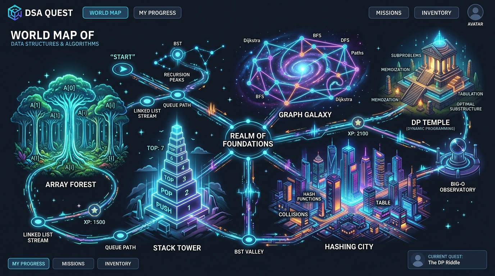
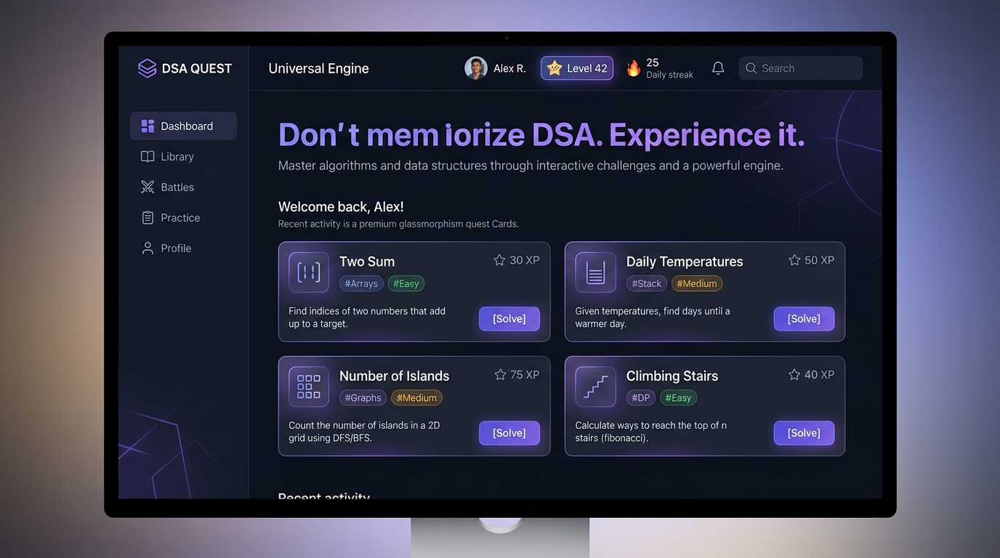
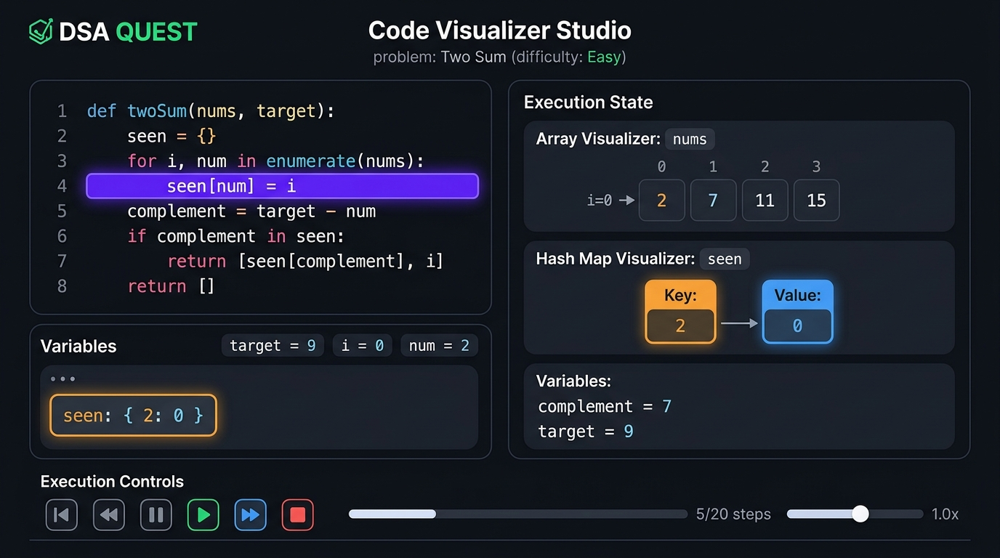
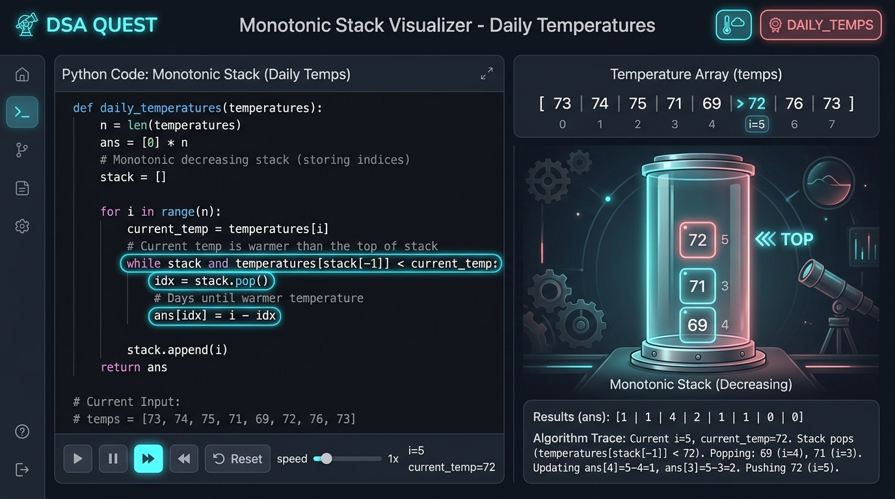
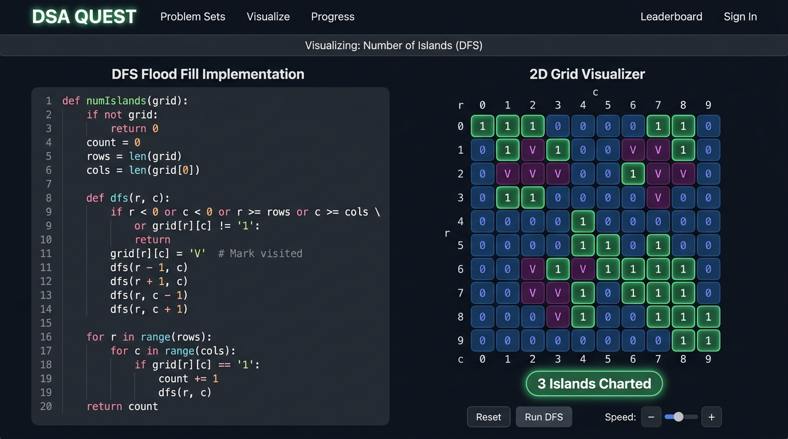
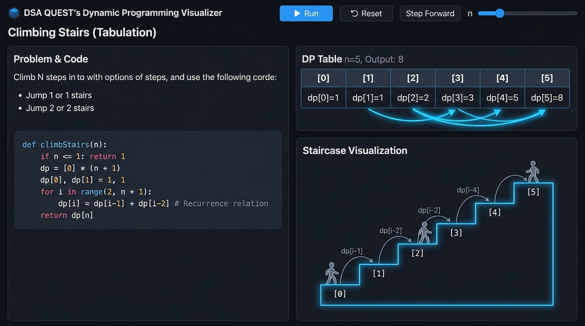

# DSA QUEST 🎮🐍

> *"Don't memorize DSA. Experience it."*

[](https://nextjs.org/)
[](https://www.typescriptlang.org/)
[](https://tailwindcss.com/)
[](https://www.python.org/)
[](https://fastapi.tiangolo.com/)
[](https://opensource.org/licenses/MIT)

**DSA QUEST** transforms Data Structures & Algorithms learning from static textbook reading into an interactive, game-like adventure. 

Instead of memorizing algorithmic tricks, learners explore real-life narrative analogies, play hands-on state mechanics, trace step-by-step memory mutations, inspect variable transitions, and solve progressively challenging problems that build interview-grade intuition.

---

## ✨ Features

- 🎮 **Interactive DSA Games**: Reusable mechanics (*Pair Selection, Push/Pop Stack, Grid Island Flood-Fill, DP Staircase Ascent, Binary Search Walk*).
- 📖 **Real-Life Stories**: Every problem begins with a vivid real-world mission (*Ice Cream Budgeting, Mountain Weather Barometer, Archipelago Cartography, Magical Staircase*).
- 🧸 **Explain Like I'm 5 Mode**: 4 switchable cognitive perspectives (*ELI5*, *Beginner Friendly*, *Algorithmic Core*, and *FAANG Interview*).
- 💡 **Progressive Clues**: 5-tier hint engine (*Observation $\to$ Memory $\to$ Data Structure $\to$ Pattern $\to$ Complete Blueprint*).
- 🎨 **Algorithm Visualizations**: Registry-based visualizers for Arrays, Hash Maps, Monotonic Stacks, 2D Grids, DP Tables, Trees, and Call Stacks.
- 🐍 **Python Code Execution**: Secure sandboxed Python execution engine generating structured line-by-line event traces.
- 🔦 **Line-by-Line Execution**: Synchronized active line glow and step-by-step code highlighting.
- 📦 **Variable and Memory Visualization**: Live animated variable chips tracking state transitions with value diffs ($seen: \{\} \to seen: \{2: 0\}$).
- 🎬 **Execution Animations**: Visual primitives for pointer movements, stack pushes/pops, hash lookups, and grid traversals.
- 🤖 **AI Tutor Layer**: Interactive coaching assistant powered by Google Gemini API with comprehensive offline fallback.
- ✍️ **Code Practice Lab**: 5 interactive modes (*Fill in Blanks, Fix Bug, Predict Output, Reorder Lines, and Monaco Write-From-Scratch*).
- 🐛 **Debugging Challenges**: Isolate subtle edge-case bugs and mutation ordering issues.
- 📊 **Big-O Complexity Lab**: Dynamic operation counters scaling from $N=10$ to $N=5,000$ comparing Brute Force $O(n^2)$ vs Optimal $O(n)$.
- 🏆 **XP and Achievements**: Earn experience points, maintain daily streaks, unlock trophy badges, and level up.
- 🗺️ **DSA World Map**: Journey across thematic algorithm realms (*Array Forest, Hashing City, Stack Tower, Graph Galaxy, DP Temple*).
- ⚔️ **Pattern Recognition Arena**: Test interview intuition by classifying unseen problem statements into optimal patterns.
- 🧩 **Custom Problem Creator**: Add ANY new DSA problem via JSON configuration without writing a single line of frontend code.

---

## 🧠 Universal Engine Architecture

DSA Quest is **NOT** a collection of hard-coded algorithm pages. The application is powered by a **Universal Engine** where problems are defined purely as structured data.

```
                              LEARNER REQUEST
                                     │
                                     ▼
                           [ Problem Registry ]
                       (Pure Structured Data Schema)
                                     │
                                     ▼
                         /problem/[id] Dynamic Route
                                     │
                                     ▼
                      ┌──────────────────────────────┐
                      │   UNIVERSAL PROBLEM ENGINE   │
                      └──────────────┬───────────────┘
                                     │
        ┌──────────────┬─────────────┼──────────────┬──────────────┐
        │              │             │              │              │
        ▼              ▼             ▼              ▼              ▼
  [Story Engine]  [Game Engine] [Visualizer]   [Trace Engine] [Practice Lab]
    - Missions     - Pair Match   - Array        - Event Stream - Fill Blanks
    - Analogies    - Push/Pop     - Hash Map     - Line Glow    - Fix Bug
    - ELI5/FAANG   - Grid Flood   - Stack/Queue  - Var Diffs    - Output Guess
                   - DP Tabulate  - 2D Matrix    - Call Stack   - Reorder
                   - Pointer Walk - DP Table                    - Monaco IDE
                                  - Call Stack
```

### The 14 Modular Sub-Engines:
1. **Problem Definition Engine (`src/types/problem.ts`)**: Pure TypeScript schema defining problem metadata, algorithms, test cases, and visualizations.
2. **Problem Registry (`src/lib/problems/registry.ts`)**: Catalog managing built-in seed problems and runtime user-imported problems.
3. **Story Engine (`src/components/story/UniversalStoryView.tsx`)**: Renders narrative briefs, characters, and industry applications.
4. **Concept Explanation Engine (`src/components/story/ConceptExplainer.tsx`)**: Multi-tier cognitive explanation tabs.
5. **Interactive Game Engine (`src/components/game/UniversalGameEngine.tsx`)**: Reusable game mechanics HUD with lives, moves, and feedback.
6. **Visualizer Registry (`src/components/visualizers/UniversalVisualizer.tsx`)**: Registry dynamically mounting visualizers based on memory state.
7. **Python Trace Sandbox (`backend/tracer.py` & `src/lib/execution/clientTracer.ts`)**: AST-validated Python tracer emitting semantic event streams.
8. **Variable Diff Engine (`src/components/code/VariableInspector.tsx`)**: Animates in-place variable mutations with history.
9. **Step Intel Engine (`src/components/code/ExecutionStepExplainer.tsx`)**: Generates *What Happened*, *Why*, and *What Changed* for every step.
10. **Progressive Clue Engine (`src/components/hints/UniversalClueEngine.tsx`)**: 5-stage progressive unlockable hints.
11. **AI Tutor Abstraction (`src/lib/ai/aiProvider.ts`)**: Multi-provider layer for Gemini API and offline expert tutoring.
12. **Practice Engine (`src/components/practice/UniversalPracticeEngine.tsx`)**: 5 practice challenge modes.
13. **Big-O Complexity Lab (`src/components/complexity/ComplexityComparator.tsx`)**: Interactive Big-O scaling simulator.
14. **World Map & Gamification (`src/app/map/` & `src/app/arena/`)**: Progression map, XP leveling, and pattern quiz arena.

---

## 🎮 How Learning Works

```
REAL-LIFE STORY
      ↓
MISSION CHALLENGE
      ↓
INTERACTIVE GAME
      ↓
THINKING CHALLENGE
      ↓
CLUES & HINTS
      ↓
ALGORITHM INTEL
      ↓
STEP-BY-STEP VISUALIZATION
      ↓
LINE-BY-LINE PYTHON EXECUTION
      ↓
VARIABLE & MEMORY DIFFS
      ↓
PRACTICE (Fill Blanks • Fix Bug • Reorder)
      ↓
WRITE FROM SCRATCH (Monaco Editor)
      ↓
BIG-O COMPLEXITY SCALING
      ↓
PATTERN RECOGNITION CHALLENGE
```

---

## 🔥 Supported Demonstrations

All demonstration problems run through the **exact same universal engine and dynamic route** (`/problem/[id]`):

| Problem | Pattern | Primary Visualizer | Interactive Game Mechanic | Real-Life Story |
| :--- | :--- | :--- | :--- | :--- |
| **Two Sum** | Hashing | Array + Hash Map | Pair Selection | *Ice Cream Parlor Budget* |
| **Daily Temperatures** | Monotonic Stack | Monotonic Stack + Array | Push / Pop Stack | *Frost Peak Observatory* |
| **Number of Islands** | DFS / BFS | 2D Grid Matrix | Grid Island Flood-Fill | *Archipelago Cartography* |
| **Climbing Stairs** | Dynamic Programming | DP Table + Call Stack | DP Staircase Ascent | *Tower of 1000 Steps* |
| **Valid Parentheses** | Stack | LIFO Stack Chamber | Rune Match Push/Pop | *Ancient Portal Locks* |
| **Binary Search** | Binary Search | Array (L, Mid, R) | Search Space Walk | *King Arthur's Vault Code* |

---

## 📸 Screenshots

### 🗺️ Interactive DSA World Map


### 🚀 Platform Dashboard & Quests


### 🎬 Code Visualizer Studio & Execution Trace


### 🗼 Monotonic Stack Visualizer (Daily Temperatures)


### 🏝️ 2D Grid Visualizer (Number of Islands)


### 🏛️ Dynamic Programming Tabulation (Climbing Stairs)


---

## 🏗️ Project Architecture

```
dsa-quest/
├── backend/
│   ├── main.py                     # FastAPI routes (/api/trace, /api/ai/explain)
│   ├── tracer.py                   # AST-based Python execution tracer & event generator
│   ├── sandbox.py                  # AST security sandbox with timeouts & restrictions
│   └── requirements.txt            # Python dependencies
├── docs/
│   └── screenshots/                # Real high-resolution UI screenshots
├── src/
│   ├── app/
│   │   ├── page.tsx                # DSA Quest Hero & Problem Catalog
│   │   ├── problem/[id]/page.tsx   # UNIFIED DYNAMIC ROUTE (Single Engine for all problems)
│   │   ├── map/page.tsx            # Interactive DSA World Map
│   │   ├── arena/page.tsx          # Pattern Recognition Trainer Arena
│   │   ├── create/page.tsx         # Universal Problem Creator & JSON Importer
│   │   ├── layout.tsx              # Root Layout with Nav, XP HUD, and Trophy Modal
│   │   └── globals.css             # Tailwind CSS tokens & glassmorphic styles
│   ├── components/
│   │   ├── engine/
│   │   │   ├── UniversalProblemEngine.tsx # Master Orchestrator for all 14 engines
│   │   │   ├── StageNavigation.tsx        # Story -> Game -> Visualizer -> Practice -> Boss
│   │   │   └── ControlBar.tsx             # Play/Pause, Step, Speed, Scrubber controls
│   │   ├── visualizers/
│   │   │   ├── UniversalVisualizer.tsx    # Registry container for visual primitives
│   │   │   ├── ArrayVisualizer.tsx        # Indexed cells with multi-pointer badges
│   │   │   ├── HashMapVisualizer.tsx      # Key-Value cards with lookup scanner
│   │   │   ├── StackVisualizer.tsx        # Glass vertical chamber with LIFO physics
│   │   │   ├── GridVisualizer.tsx         # 2D interactive matrix with coordinates
│   │   │   ├── DPTableVisualizer.tsx      # DP array with state transition dependency arrows
│   │   │   └── CallStackVisualizer.tsx    # Recursion call frame stack
│   │   ├── game/
│   │   │   ├── UniversalGameEngine.tsx    # Game HUD, hearts, moves, feedback, confetti
│   │   │   ├── PairSelectionGame.tsx      # Two Sum pair matching mechanic
│   │   │   ├── PushPopStackGame.tsx       # Monotonic stack & bracket push/pop mechanic
│   │   │   ├── GridExplorerGame.tsx       # 2D island flood-fill mechanic
│   │   │   ├── DPStairFillGame.tsx        # DP staircase climb state-filling mechanic
│   │   │   └── PointerWalkGame.tsx        # Binary search boundary adjustment mechanic
│   │   ├── story/
│   │   │   ├── UniversalStoryView.tsx     # Narrative brief, character avatar, real-world case
│   │   │   └── ConceptExplainer.tsx       # ELI5 / Beginner / Intermediate / Interview tabs
│   │   ├── code/
│   │   │   ├── CodeViewer.tsx             # Syntax highlighter with active line glow
│   │   │   ├── VariableInspector.tsx      # Animated variable state transitions (old -> new)
│   │   │   └── ExecutionStepExplainer.tsx # What Happened, Why, and What Changed
│   │   ├── hints/
│   │   │   └── UniversalClueEngine.tsx    # 5-tier progressive unlockable clue engine
│   │   ├── practice/
│   │   │   ├── UniversalPracticeEngine.tsx# Practice challenge mode selector
│   │   │   ├── FillBlanksChallenge.tsx    # Code slot drop-downs
│   │   │   ├── FixBugChallenge.tsx        # Bug diagnosis and patch selector
│   │   │   ├── PredictOutputChallenge.tsx # Mental simulation question
│   │   │   ├── ReorderLinesChallenge.tsx  # Drag & drop code sequence reconstructor
│   │   │   └── MonacoPracticeEditor.tsx   # Monaco Editor with test runner & console
│   │   ├── complexity/
│   │   │   └── ComplexityComparator.tsx   # Big-O interactive input scaling simulator
│   │   └── ai/
│   │       └── AITutorPanel.tsx           # Multi-tier AI coaching chat
│   ├── lib/
│   │   ├── problems/
│   │   │   ├── registry.ts                # Problem Registry and query dispatcher
│   │   │   └── definitions/               # Pure data definitions ONLY
│   │   │       ├── two-sum.ts
│   │   │       ├── daily-temperatures.ts
│   │   │       ├── number-of-islands.ts
│   │   │       ├── climbing-stairs.ts
│   │   │       ├── valid-parentheses.ts
│   │   │       └── binary-search.ts
│   │   ├── execution/
│   │   │   ├── clientTracer.ts            # Client deterministic trace generator
│   │   │   └── apiTracer.ts               # Backend API trace client
│   │   ├── ai/
│   │   │   └── aiProvider.ts              # Gemini API & offline knowledge base
│   │   └── state/
│   │       └── useUserProgress.ts         # LocalStorage-backed XP, streaks, trophies
│   └── types/
│       ├── problem.ts                     # Complete Problem Definition Schema
│       ├── execution.ts                   # Semantic Event & Execution Trace Schema
│       ├── game.ts                        # Game state and action types
│       └── gamification.ts                # User progress and trophy types
├── package.json
├── tsconfig.json
├── tailwind.config.js
└── README.md
```

---

## 🛠️ Tech Stack

- **Frontend**: [Next.js 14](https://nextjs.org/) (App Router), [React 18](https://react.dev/), [TypeScript 5.6](https://www.typescriptlang.org/), [Tailwind CSS](https://tailwindcss.com/), [Framer Motion](https://www.framer.com/motion/), [Monaco Editor](https://microsoft.github.io/monaco-editor/), [Canvas Confetti](https://www.kirilv.com/canvas-confetti/).
- **Backend / Tracing**: [Python 3.12](https://www.python.org/), [FastAPI](https://fastapi.tiangolo.com/), [Uvicorn](https://www.uvicorn.org/), AST parser, sandbox execution monitor.
- **AI Tutoring**: [Google Gemini 1.5](https://ai.google.dev/) API integration with offline fallback.

---

## 🚀 Getting Started

### 1. Clone the Repository
```bash
git clone https://github.com/tejaswini143-byte/dsa-quest.git
cd dsa-quest
```

### 2. Install Dependencies
```bash
npm install
```

### 3. Configure Environment Variables
Copy the template file to `.env.local`:
```bash
cp .env.example .env.local
```
Optionally add your Google Gemini API key:
```env
NEXT_PUBLIC_GEMINI_API_KEY=your_gemini_api_key_here
NEXT_PUBLIC_BACKEND_URL=http://localhost:8000
```
*(Note: DSA Quest works 100% offline out-of-the-box even without an API key!)*

### 4. Run Frontend
```bash
npm run dev
```
Open [http://localhost:3000](http://localhost:3000) in your browser.

### 5. Run Python Backend (Optional)
```bash
cd backend
python -m venv venv

# Windows:
.\venv\Scripts\activate
# macOS/Linux:
source venv/bin/activate

pip install -r requirements.txt
python main.py
```
FastAPI runs at [http://localhost:8000](http://localhost:8000) with interactive Swagger docs at `/docs`.

---

## 🔐 Security & Sandbox Guarantees

User code execution is protected by multi-layer security:
1. **AST Node Filtering**: Disallows dangerous modules (`os`, `sys`, `subprocess`, `socket`, `open`, `eval`, `exec`, network calls).
2. **Execution Timeouts**: Strict 3.0-second timeout per execution step.
3. **Step Limits**: Tracing capped at 500 execution steps to prevent infinite loop locking.
4. **Git Security**: `.gitignore` strictly protects `.env*`, `node_modules`, `.next`, and Python cache artifacts from ever being committed.

---

## 🧩 Adding New Problems (Zero Frontend Code Required)

To add a new problem to DSA Quest, simply define a JSON schema or use the built-in [**Problem Creator**](http://localhost:3000/create):

```json
{
  "id": "my-custom-problem",
  "title": "My Custom DSA Problem",
  "difficulty": "medium",
  "category": "stack",
  "patterns": ["Monotonic Stack"],
  "story": {
    "theme": "space-mission",
    "missionTitle": "Satellite Buffer Calibration",
    "missionBrief": "Calibrate signal wavelengths...",
    "analogy": "A stack holding signal indices...",
    "character": { "name": "Astro", "avatar": "🚀", "role": "Commander" },
    "realWorldScenario": "Sensor buffer processing"
  },
  "explanation": {
    "eli5": "Simple ELI5 explanation...",
    "beginner": "Beginner walkthrough...",
    "intermediate": "Algorithmic invariant...",
    "interview": "Big-O and edge cases..."
  },
  "game": {
    "type": "push-pop-stack",
    "mission": "Resolve smaller frequencies...",
    "instructions": ["Push new frequencies", "Pop smaller values"],
    "initialData": [10, 20, 15, 30]
  },
  "visualization": {
    "primaryType": "stack",
    "secondaryTypes": ["array"],
    "defaultInput": { "nums": [10, 20, 15, 30] }
  },
  "algorithm": {
    "name": "Monotonic Stack",
    "pattern": "Monotonic Stack",
    "bruteForce": { "name": "Brute Force", "timeComplexity": "O(n²)", "pythonCode": "..." },
    "optimal": { "name": "Optimal Stack", "timeComplexity": "O(n)", "pythonCode": "..." }
  }
}
```

Once registered, the **Universal Engine** automatically handles rendering the story, interactive game, visualizer, line execution, variable transitions, and practice challenges!

---

## 🗺️ Roadmap

- [x] Universal Data-Driven Engine Architecture
- [x] Repertoire of Core DSA Paradigms (Two Sum, Daily Temperatures, Number of Islands, Climbing Stairs, Valid Parentheses, Binary Search)
- [x] Interactive Reusable Game Mechanics
- [x] 5-Tier Progressive Clue Engine
- [x] Big-O Complexity Lab
- [x] Interactive World Map & Pattern Recognition Arena
- [x] Universal JSON Problem Creator
- [ ] Trees & Lowest Common Ancestor (LCA) Visualizer
- [ ] Graph Shortest Path (Dijkstra) & Topological Sort
- [ ] Knapsack & 2D Grid Dynamic Programming
- [ ] Multi-Language Execution Support (JavaScript, Java, C++)

---

## 🤝 Contributing

Contributions are welcome! To add new problem schemas, game mechanics, or visualizer primitives:
1. Fork the repository.
2. Create your feature branch (`git checkout -b feature/new-dsa-pattern`).
3. Commit your changes (`git commit -m "feat: add sliding window visualizer"`).
4. Push to the branch (`git push origin feature/new-dsa-pattern`).
5. Open a Pull Request.

---

## 📄 License

This project is licensed under the **MIT License**.
